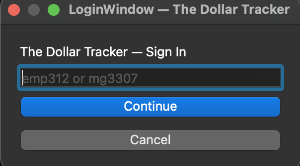
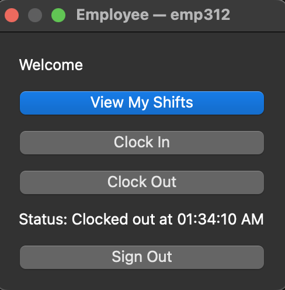
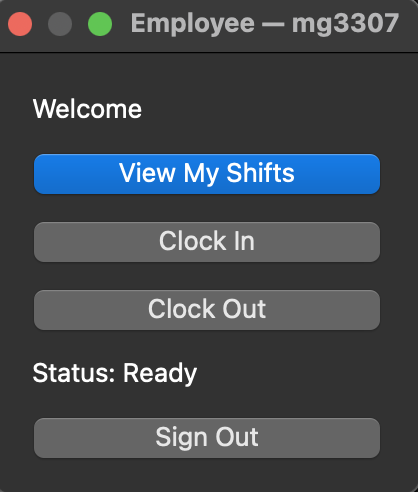

# The Dollar Tracker

A C++/Qt desktop application for managing employee work hours, scheduling, and payroll through role-based workflows.

## 🚀 Overview
The Dollar Tracker is a desktop application designed to help businesses efficiently manage employee operations. It allows employees to clock in/out, view shifts, and track their work status through a clean and intuitive interface.

## 💡 Features
- Secure employee login system (ID-based authentication)
- Employee dashboard with real-time status tracking
- Clock in / clock out functionality
- Shift viewing interface
- Role-based workflow (employee-focused system)
- File-based data management
- Input validation for reliable and safe data handling

## 🛠 Tech Stack
- **C++**
- **Qt Framework (GUI)**
- **CMake**
- File-based storage system

## 📸 Screenshots

### 🔐 Login Window


### 👤 Employee Dashboard


### 👤 Manager Dashboard (Ready State)


## ▶️ How to Run

```bash
git clone https://github.com/Krahme1/the-dollar-tracker.git
cd the-dollar-tracker
mkdir build
cd build
cmake -DCMAKE_PREFIX_PATH="$(brew --prefix qt)" ..
make
./the-dollar-tracker
